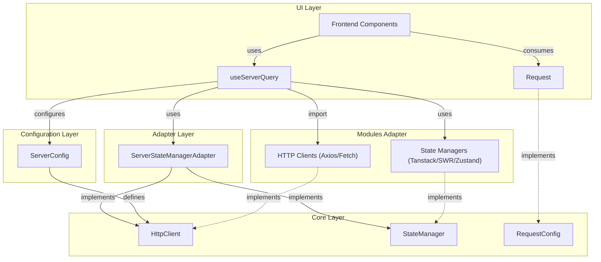

# Server State Manager Adapter Module

## Description

This module is a adapter to provide server state manager for hexagonal structured project.

## Monorepo Structure

This project is set up as a monorepo using [Turborepo](https://turbo.build/repo) for efficient build system management. The monorepo contains:

- **packages/ServerStateManagerAdapter**: The core adapter library
- **example**: A React application demonstrating the usage of the adapter

### Using Turborepo

Turborepo helps manage the build process across all packages in the monorepo. Here are the main commands:

```bash
# Install dependencies for all packages
pnpm install

# Run development server for all packages
pnpm run dev

# Build all packages
pnpm run build

# Lint all packages
pnpm run lint

# Clean all packages
pnpm run clean
```

### Code Formatting

This project uses [Prettier](https://prettier.io/) for code formatting. The configuration is defined in `.prettierrc.json` at the root of the project.

#### Formatting Commands

```bash
# Format all files
pnpm run format

# Check if files are formatted correctly
pnpm run format:check
```

#### IDE Integration

For IntelliJ IDEA / WebStorm users, the project includes configuration for format-on-save functionality. When you save a file, Prettier will automatically format it according to the project's formatting rules.

For VS Code users, install the [Prettier extension](https://marketplace.visualstudio.com/items?itemName=esbenp.prettier-vscode) and enable format-on-save in your settings:

```json
{
  "editor.formatOnSave": true,
  "editor.defaultFormatter": "esbenp.prettier-vscode"
}
```

## Example Playground

An example React application is included in the `example` directory to demonstrate how to use the ServerStateManagerAdapter in a real-world scenario. The playground includes several examples:

- **Basic Usage**: Simple data fetching with default configuration
- **Configuration Options**: Customizing the adapter with different settings
- **Custom Fetch Implementation**: More complex data fetching scenarios

### Running the Example

To run the example playground:

```bash
# Navigate to the example directory
cd example

# Install dependencies
npm install

# Start the development server
npm run dev
```

The example will be available at http://localhost:3000

## How to use

### Configuration

#### Configure server(s) instance(s)

// How do to purpose fetch, axios or another implementation ? And maybe distinct rest and graphql ?

```ts
new ServerStateManagerAdapter.HttpClient({
  url: string,
  port: string,
});
```

#### Create Requests

```ts
import { ServerStateManagerAdapter } from 'server-state-manager-adapter';

interface RequestConfig {
  method: 'GET' | 'POST' | 'PUT' | 'DELETE' | 'PATCH';
  uri: string;
}

const createRequest = (server: ServerStateManagerAdapter.HttpClient, config: RequestConfig) => ({
  queryFn: server.fetch<Shoes[]>({
    method: config.method,
    uri: config.uri,
  }),
  select: () => {
    /* ... */
  },
  refetchOnFocus: true,
});
```

#### On frontend

```ts
import server from '../conf/server.ts';

function MyReactComponent() {
  const { data, isLoading, isError } = useServerQuery(
    createRequest(server, {
      method: 'GET',
      uri: '/my-shoes',
    })
  );
}
```

Based on the provided code and structure, I'll list the advantages of this architectural approach:

- Clean separation of concerns through the adapter pattern, isolating server state management from the rest of the application
- Type-safe implementation using TypeScript for better development experience and error catching
- Flexible configuration allowing multiple server instances with different settings
- Abstract HTTP client implementation that can be swapped (fetch, axios, etc.) without affecting consuming code
- Consistent request creation pattern that enforces standardization across the application
- Built-in support for common HTTP methods (GET, POST, PUT, DELETE, PATCH) (and more)
- Extensible design that allows adding custom selection and transformation logic
- Follows hexagonal architecture principles, making the system more maintainable and testable
- Clear type definitions for request configurations and responses
- Centralized server configuration management
- Easy access to loading and error states in components
- Modular structure that enables easy unit testing of each part independently



## Architectural Benefits

This structure provides several key advantages for system flexibility:

### Framework Independence

- Frontend framework changes only require adapter modifications
- Core business logic remains untouched
- Minimal refactoring needed for UI layer switches

### Server Provider Flexibility

- Seamless switching between compatible HTTP providers (e.g., Axios ↔ Fetch ↔ SuperAgent)
- Infrastructure changes can be implemented with minimal codebase impact
- Provider-specific optimizations can be encapsulated in the adapter

### Protocol Adaptability

- Changing server protocols (REST ↔ GraphQL ↔ WebSocket) requires only:
  - ServerProvider implementation updates
  - Request configuration builder modifications
- Core application logic remains protocol-agnostic
- Maintains clean separation of concerns

This design follows the Interface Segregation Principle, making the system highly maintainable and adaptable to change.
